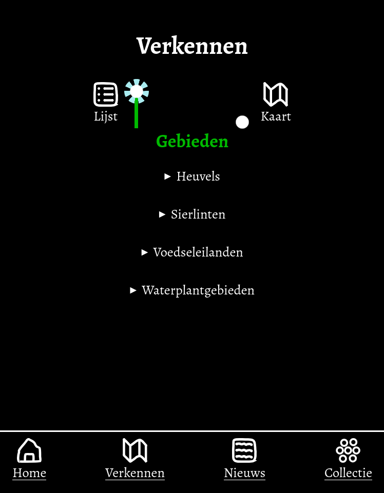
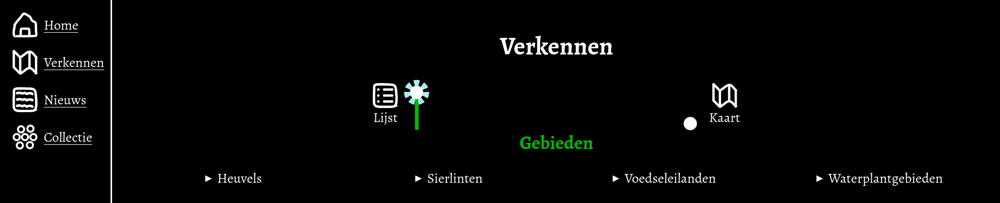
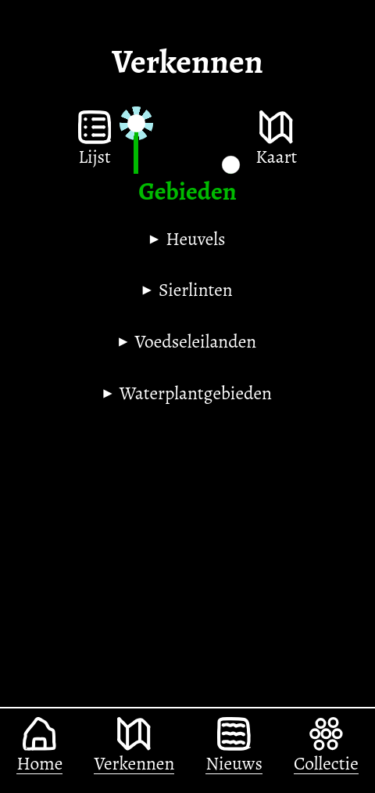
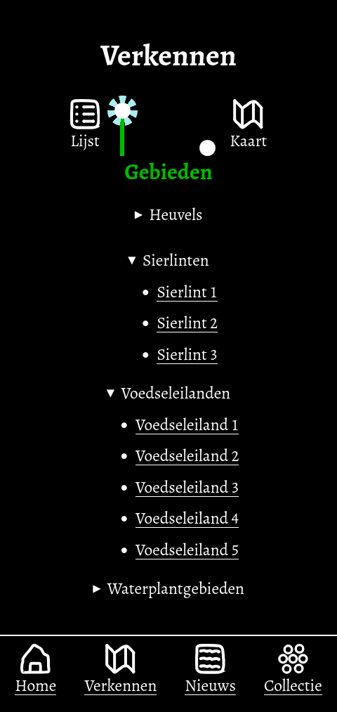
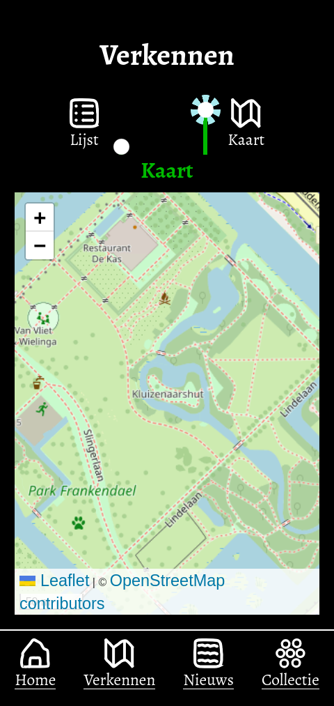

# Website voor Bloemenveld Frankendael

## Introductie
In Amsterdam is in Park Frakendael een gebied met de naam "Bloemenveld Frankendael". Het is de bedoeling dat er een webpagina komt waarop bezoekers informatie kunnen zien over het gebied.

Er was eerder een prototype gemaakt voor het gebied, maar de opdrachtgever wil graag
een Openstreetmap-kaart op de webpagina.

[Ga naar de voorlopige versie van de nieuwe website van Bloemenveld Frankendael](https://edu.nl/3n3g3).

## Beschrijving
Er is een home-pagina, maar de inhoud van deze pagina gaat nog veranderen. Twee andere pagina's zijn beter uitgewerkt: de pagina die de verschillende gebieden van het bloemenveld toont en de pagina die toont wat er in een gebied groeit.

### Gedrag bij verschillende schermgroottes
De navigatie verschijnt onder bij een smal scherm en links bij een breed scherm.

*Smalle weergave*

*Brede weergave*

### Verkennen-pagina
Deze pagina toont de verschillende gebieden van Bloemenveld Frankendael.
Je kan kiezen tussen een lijstweergave en een plattegrondweergave. 

De plattegrondweergave toont een openstreetmap-kaart, maar deze bevat nog geen links naar de verschillende gebieden.

De lijstweergave heeft verschillende categorieën die je open kan klikken.

*Verkennen: lijstweergave*

*Verkennen: lijstweergave. De categorieën "Sierlinten" en "Voedseleilanden" zijn geopend.*

Je kan klikken op een gebied om het te openen. Momenteel is er echter alleen een pagina gemaakt voor Sierlint1.

Als je de kaartweergave gebruikt, dan wordt een openstreetmap-kaart getoond, maar deze heeft
nog geen links naar gebieden.

*Verkennen: kaartweergave*

### Gebiedpagina
Er is momenteel maar één gebiedpagina: Sierlint1. 

## Kenmerken

### Icoontjes
De icoontjes zijn gemaakt met het programma Inkscape. Het was leuk om te doen, maar
er zijn ook websites met voorgemaakte icoontjes zoals [Tabler](https://tabler.io/icons).

Alle icoontjes staan in hetzelfde svg-bestand. Per icoontje is er een `<symbol>`-element.

### Plattegrond
Voor de openstreetmap-kaart wordt de javascript-library [Leaflet](https://leafletjs.com/) gebruikt. 
De library [Openlayers](https://openlayers.org/) is recenter bijgewerkt, maar het lijkt erop dat deze
niet eenvoudig zonder framework te gebruiken is.

### HTML-structuur
TODO

### CSS
TODO

<!-- Bij Kenmerken staat welke technieken zijn gebruikt en hoe. Wat is de HTML structuur? Wat zijn de belangrijkste dingen in CSS? Wat is er met Javascript gedaan en hoe? Misschien heb je een framwork of library gebruikt? -->

## Licentie

This project is licensed under the terms of the [MIT license](./LICENSE).
